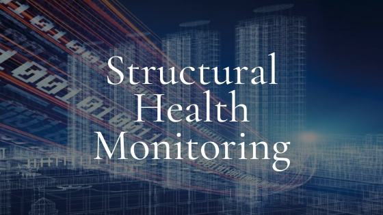

# Structural Health Monitoring & Retrofitting 

| **[Contents](Contents/Content.md)** | **[Syllabus](Contents/Syllabus.md)** | **[Assignments (Jan-June 2026)](Contents/Assignment_2026.md)** | **[Contact](Contents/Contact.md)** |  

🚨 **New Assignments are now available. For details on due dates and submission instructions — [Click Here](Contents/Assignment_2026.md)**

  

---

*Disclamer: All rights and credits reserved to the respective owner(s) of the uploaded content/images. The uploaded content is solely for educational purpose. If you are the main copyright owner, contact to claim credit or content removal.*

---

